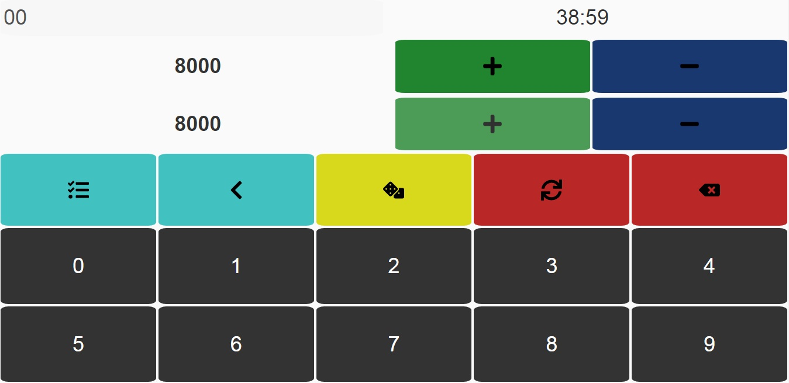

# Sarau da Praça

- [Overview](#overview)
- [Requirements](#requirements)
- [Installation](#installation)
- [Available Scripts](#available-scripts)
- [Current Project](#current-project)
- [Learn More](#learn-more)


## Overview

This project was bootstrapped with [Create React App](https://github.com/facebook/create-react-app).

A simple Yugioh duel calculator for face-to-face duels with changes to layout performance in desktop or mobile to use calculator for two players simultaneously or not.

## Requirements

- **[Node.js](https://www.nodejs.org/)** (supported versions: 10.x.x) for acess to npm package manager

## Installation

### Install all dependencies
```bash
$ npm install 
```

### Available Scripts

In the project directory, you can run:

```bash
$ npm start 
```

Runs the app in the development mode.<br />
Open [http://localhost:3000](http://localhost:3000) to view it in the browser.

The page will reload if you make edits.<br />
You will also see any lint errors in the console.

```bash
$ npm run build
```

Builds the app for production to the `build` folder.<br />
It correctly bundles React in production mode and optimizes the build for the best performance.

The build is minified and the filenames include the hashes.<br />
Your app is ready to be deployed!

See the section about [deployment](https://facebook.github.io/create-react-app/docs/deployment) for more information.

## Current Project

- This project is projected to use calculator for two players simultaneously or not. In Mobile view, each player can use your respective calculator and in Desktop view have a one calculator for each display life points.




## Learn More

You can learn more in the [Create React App documentation](https://facebook.github.io/create-react-app/docs/getting-started).

To learn React, check out the [React documentation](https://reactjs.org/).
